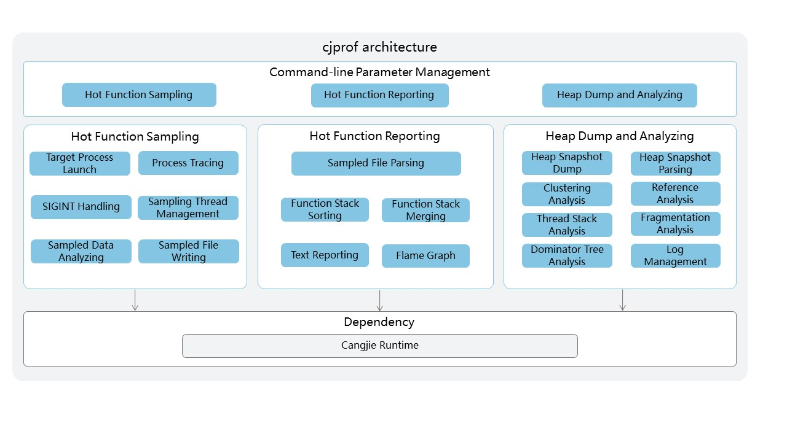

# Cangjie Profiler Developer Guide

## Introduction

`cjprof` (Cangjie Profile) is the performance profiling tool for the Cangjie language. Its overall technical architecture is shown in the figure:



## Directory Structure

The source code directory of `cjprof` is shown below, with its main functions described in the comments.

```text
cjprof/
|-- build                   # Build scripts
|-- doc                     # Documentation
|-- figures                 # Images
|-- src                     # Source code files
`-- tests                   # Test cases
```

## Installation and Usage Guide

The following tools are required to build `cjprof`:
- `cangjie runtime`
    - Developers need to download the Cangjie runtime for the corresponding platform: to compile artifacts for the local platform, the required runtime must be the version matching the current platform
    - Then, developers need to execute the envsetup script of the corresponding runtime to ensure the runtime is properly configured.

### Build Preparation

- Building `cjprof` depends on `cangjie runtime`; for the build method, please refer to [SDK Build](https://gitcode.com/Cangjie/cangjie_build/blob/dev/README.md)

### Build Steps

#### Build Method 1: Compile Using Build Script

1. Obtain the latest source code of `cjprof` via the git clone command:

    ```shell
    cd ${WORKDIR}
    git clone https://gitcode.com/Cangjie/cangjie_tools.git
    ```
2. Compile `cjprof` using the build script in the `cjprof/build` directory:

    ```shell
    cd cangjie-tools/cjprof/build
    python3 build.py build -t release
    ```

    Two build types are currently supported: `debug` and `release`. Developers must specify the type via `-t` or `--build-type`.

3. Install to a specified directory:

    ```shell
    python3 build.py install
    ```
    
    The default installation directory is `cjprof/dist`. Developers can specify a custom installation directory via the `--prefix` parameter of the `install` command:

    ```shell
    python3 build.py install --prefix ./output
    ```
    The compiled artifact directory structure is:

    ```
    dist/
    |-- bin
        `-- cjprof                   # Executable file: on Windows, it is cjprof.exe
    |-- lib
    ```

4. Verify successful installation of cjprof:

    ```shell
    ./cjprof -h
    ```

    Developers navigate to the bin directory under the installation path and execute the above command. If the help information for cjprof is printed, the installation is successful. Taking the Linux environment as an example:

    ```shell
    export LD_LIBRARY_PATH=$CANGJIE_HOME/tools/lib:$LD_LIBRARY_PATH
    ./cjprof -h
    ```

5. Clean intermediate build artifacts:

    ```shell
    python3 build.py clean
    ```

### More Build Options

The `python3 build.py build` command supports additional parameter configurations, which can be queried via the following command:

```shell
python3 build.py build -h
```

## API and Configuration Description

`cjprof` provides the following main commands for project building and configuration management.

### Command Introduction

Command-line usage: `cjprof [option] file [option] file`

`cjprof -h` displays help information. The options are described below:

```text
Usage: cjprof [--help] COMMAND [ARGS]

The supported commands are:
  -v        Print version of cjprof
  heap      Dump heap memory to a dump file or analyze a heap dump file
  record    Run a command and record its profile data to a data file
  report    Read a profile data file (created by cjprof record) and display the profiling results
```

## Related Repositories

- [cangjie SDK](https://gitcode.com/Cangjie/cangjie_build)
