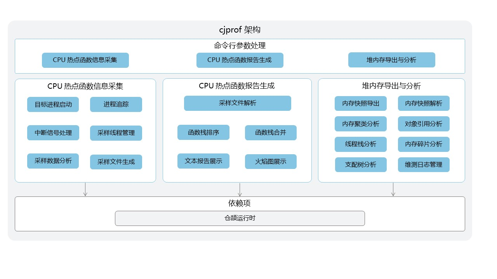

# 仓颉性能分析工具开发者指南

## 开源项目介绍

`cjprof`（Cangjie Profile）是仓颉语言的性能分析工具。其整体技术架构如图所示：



## 目录

`cjprof` 源码目录如下图所示，其主要功能如注释中所描述。

```text
cjprof/
|-- build                   # 构建脚本
|-- doc                     # 介绍文档
|-- figures                 # 图片
|-- src                     # 源码相关文件
`-- tests                   # 测试用例
```

## 安装和使用指导

`cjprof` 需要以下工具来构建：

- `cangjie runtime`
    - 开发者需要下载对应平台的仓颉运行时：若想要编译本地平台产物，则需要的 `runtime` 为当前平台对应的版本
    - 然后，开发者需要执行对应 `runtime` 的 `envsetup` 脚本，确保 `runtime` 被正确配置。

### 构建准备

- `cjprof` 构建依赖 `cangjie runtime`, 构建方式参见[SDK 构建](https://gitcode.com/Cangjie/cangjie_build/blob/dev/README_zh.md)


### 构建步骤

#### 构建方式一：使用构建脚本编译

1. 通过 `git clone` 命令获取 `cjprof` 的最新源码：

    ```shell
    cd ${WORKDIR}
    git clone https://gitcode.com/Cangjie/cangjie_tools.git
    ```

2. 通过 `cjprof/build` 目录下的构建脚本编译 `cjprof`：

    ```shell
    cd cangjie-tools/cjprof/build
    python3 build.py build -t release
    ```

    当前支持 `debug`、`release` 两种编译类型，开发者需要通过 `-t` 或者 `--build-type` 指定。

3. 安装到指定目录：

    ```shell
    python3 build.py install
    ```

    默认安装到 `cjprof/dist` 目录下，支持开发者通过 `install` 命令的参数 `--prefix` 指定安装目录：

    ```shell
    python3 build.py install --prefix ./output
    ```

    编译产物目录结构为: 

    ```
    dist/
    |-- bin
        `-- cjprof                   # 可执行文件，Windows 中为 cjprof.exe
    |-- lib
    ```

4. 验证 `cjprof` 是否安装成功：

    ```shell
    ./cjprof -h
    ```

    开发者进入安装路径的 `bin` 目录下执行上述操作，如果输出 `cjprof` 的帮助信息，则表示安装成功。以 `Linux` 环境为例：

    ```shell
    export LD_LIBRARY_PATH=$CANGJIE_HOME/tools/lib:$LD_LIBRARY_PATH
    ./cjprof -h
    ```

5. 清理编译中间产物：

   ```shell
   python3 build.py clean
   ```

### 更多构建选项

`python3 build.py build` 命令也支持其它参数设置，具体可通过如下命令来查询：

```shell
python3 build.py build -h
```

## API 和配置说明

`cjprof` 提供以下主要命令，用于项目构建和配置管理。

### 命令介绍

使用命令行操作 `cjprof [option] file [option] file`

`cjprof -h` 获取帮助信息，选项介绍如下：

```text
Usage: cjprof [--help] COMMAND [ARGS]

The supported commands are:
  -v        Print version of cjprof
  heap      Dump heap into a dump file or analyze the heap dump file
  record    Run a command and record its profile data into data file
  report    Read profile data file (created by cjprof record) and display the profile
```

## 相关仓

- [cangjie SDK](https://gitcode.com/Cangjie/cangjie_build)
